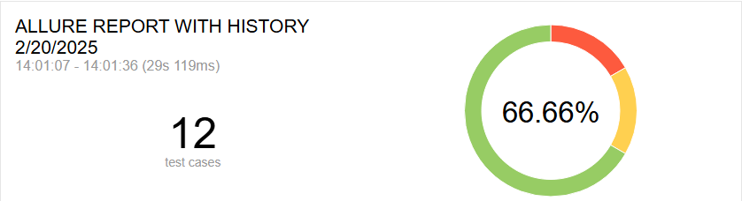

# **Java CI: Testes Automatizados e Relatórios no GitHub Pages**

Este repositório possui um fluxo de **Integração Contínua (CI)** utilizando **GitHub Actions** para validar a qualidade do código, executar testes automatizados e disponibilizar relatórios interativos via **GitHub Pages**.

## 🚀 **Pipeline de CI/CD**

O pipeline está definido no arquivo `.github/workflows/pipeline-github-actions.yml` e é composto por diversas etapas:

## 📌 **Como o Pipeline é Disparado?**
O workflow é acionado automaticamente quando:  
✔ Um **Pull Request** ou um **Push**  é aberto na branch `main`.
✔ Todos os dias as **12:00**

### **1️⃣ Compilação do Projeto**
- Baixa o código-fonte do repositório.
- Executa a construção do projeto (mvn clean install -DskipTests).
- Armazena os arquivos gerados para uso posterior.
```yaml
jobs:
  build:
    runs-on: ubuntu-latest
    steps:
      - name: Checkout do código
        uses: actions/checkout@v4

      - name: Configurar JDK 17 Temurin
        uses: actions/setup-java@v3
        with:
          distribution: 'temurin'
          java-version: '17'

      - name: Build do projeto
        run: mvn clean install -DskipTests

      - name: Salvar workspace
        uses: actions/upload-artifact@v4
        with:
          name: workspace
          path: .
```
### **2️⃣ Testes de HealthCheck**
- Recupera os arquivos da etapa anterior.
- Roda os testes de contrato (mvn test -Dgroups=HealthCheck).
- Armazena os resultados para a geração do relatório Allure.
```yaml
    Health-Check:
    runs-on: ubuntu-latest
    needs: build
    steps:
      - name: Baixar workspace
        uses: actions/download-artifact@v4
        with:
          name: workspace
          path: .

      - name: Executar testes de HealthCheck
        run: mvn test -Dgroups=HealthCheck
        continue-on-error: true

      - name: Coletar resultados do Allure
        if: always()
        uses: actions/upload-artifact@v4
        with:
          name: allure-results-healthCheck
          path: target/allure-results
```

### **2️⃣ Testes de Contrato**
- Recupera os arquivos da etapa anterior.
- Roda os testes de contrato (mvn test -Dgroups=Contrato).
- Armazena os resultados para a geração do relatório Allure.
```yaml
  test-contrato:
    runs-on: ubuntu-latest
    needs: build
    steps:
      - name: Baixar workspace
        uses: actions/download-artifact@v4
        with:
          name: workspace
          path: .
      - name: Executar testes de Contrato
        run: mvn test -Dgroups=Contrato
        continue-on-error: true
      - name: Coletar resultados do Allure
        if: always()
        uses: actions/upload-artifact@v4
        with:
          name: allure-results-contrato
          path: target/allure-results
```

### **3️⃣ Testes Funcionais**
- Baixa os arquivos processados anteriormente.
- Executa testes funcionais (mvn test -Dgroups=Funcional).
- Salva os resultados dos testes para geração do relatório.
```yaml
  test-funcional:
    runs-on: ubuntu-latest
    needs: test-contrato
    steps:
      - name: Baixar workspace
        uses: actions/download-artifact@v4
        with:
          name: workspace
          path: .
      - name: Executar testes Funcionais
        run: mvn test -Dgroups=Funcional
        continue-on-error: true
      - name: Coletar resultados do Allure
        if: always()
        uses: actions/upload-artifact@v4
        with:
          name: allure-results-funcional
          path: target/allure-results
```

### **4️⃣ Geração do Relatório Allure**
- Coleta os dados dos testes de Contrato e Funcional.
- Gera um relatório interativo com **Allure Report**.
- Publica o relatório no **GitHub Pages** para fácil acesso.
```yaml
  generate-allure-report:
    runs-on: ubuntu-latest
    needs: test-funcional
    if: always()
    permissions:
      contents: write
    steps:
      - name: Checkout do repositório
        uses: actions/checkout@v4
      - name: Baixar resultados do Allure - Contrato
        uses: actions/download-artifact@v4
        with:
          name: allure-results-contrato
          path: target/allure-results
      - name: Baixar resultados do Allure - Funcional
        uses: actions/download-artifact@v4
        with:
          name: allure-results-funcional
          path: target/allure-results
      - name: Gerar e publicar Allure Report
        uses: simple-elf/allure-report-action@master
        with:
          allure_results: target/allure-results
          allure_history: allure-history
      - name: Deploy no GitHub Pages
        uses: JamesIves/github-pages-deploy-action@4.1.4
        with:
          branch: gh-pages
          folder: allure-history
```

### **5️⃣ Análise de Segurança com CodeQL**
- Avalia vulnerabilidades no código utilizando **CodeQL**.
- Executa uma varredura automatizada para identificar possíveis riscos.
```yaml
  code-ql-analyze:
    name: Analyze
    runs-on: ubuntu-latest
    permissions:
      actions: read
      contents: read
      security-events: read
    strategy:
      fail-fast: false
      matrix:
        language: ['java']
    steps:
      - name: Checkout repository
        uses: actions/checkout@v4
      - name: Init CodeQL
        uses: github/codeql-action/init@v2
        with:
          language: ${{matrix.language}}
      - name: Autobuild
        uses: github/codeql-action/autobuild@v2
      - name: CodeQL Analysis
        uses: github/codeql-action/analyze@v2
        with:
          category: "/language:${{matrix.language}}"
```

### **6️⃣ Notificação no Discord**
- Caso os testes sejam bem-sucedidos ✅, envia uma notificação com o link para o relatório Allure.
- Em caso de falha ❌, alerta sobre os erros para investigação.
- 
<br><br>
```yaml
  notify-discord:
    runs-on: ubuntu-latest
    needs: generate-allure-report
    if: always()
    steps:
      - name: Notificar sucesso no Discord
        if: success()
        env:
          DISCORD_WEBHOOK: ${{ secrets.DISCORD_WEBHOOK }}
        run: |
          curl -H "Content-Type: application/json" \
               -X POST \
               -d '{"username": "GitHub Actions", "content": "✅ Testes concluídos com sucesso!\n🔗 [Ver relatório do Allure](https://lucaslarry.github.io/github-actions-grupo06)"}' \
               $DISCORD_WEBHOOK
      - name: Notificar falha no Discord
        if: failure()
        env:
          DISCORD_WEBHOOK: ${{ secrets.DISCORD_WEBHOOK }}
        run: |
          curl -H "Content-Type: application/json" \
               -X POST \
               -d '{"username": "GitHub Actions", "content": "❌ Testes falharam! Verifique os logs no GitHub Actions.🔗 [Ver relatório do Allure](https://lucaslarry.github.io/github-actions-grupo06)"}' \
               $DISCORD_WEBHOOK
```


## 📊 **Acesso ao Relatório Allure**
Os relatórios gerados podem ser acessados diretamente via **GitHub Pages**:  
 <br><br>
🔗 [Relatório Allure](https://lucaslarry.github.io/github-actions-grupo06)

## 🛠 **Tecnologias Utilizadas**
- **Java 17**
- **Maven**
- **TesteNG**
- **REST Assured**
- **Allure Report**
- **GitHub Actions**
- **GitHub Pages**
- **Discord Webhook**

##  **Grupo**
- **Lucas Larry**
- **Marcelo Dalcin**

